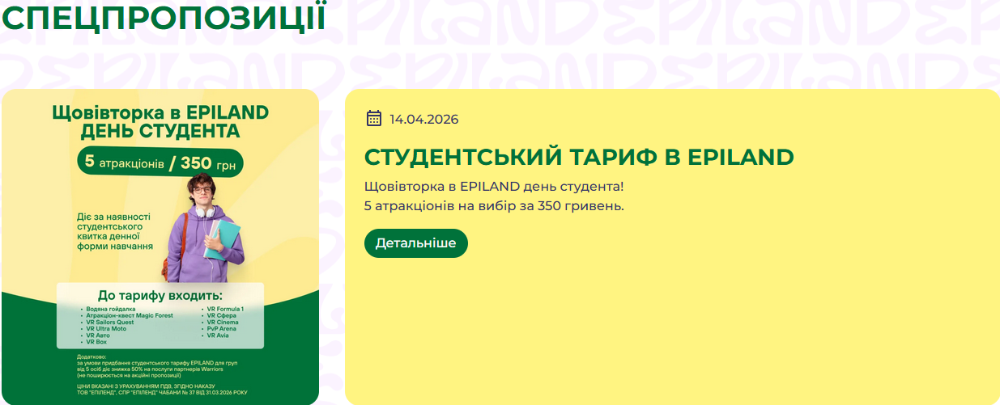
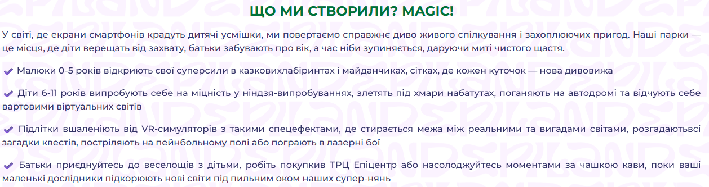

# Аналіз EPILAND

- [Аналіз EPILAND](#аналіз-epiland)
  - [Загальне ознайомлення](#загальне-ознайомлення)
  - [Цільова аудиторія](#цільова-аудиторія)
  - [Сегменти аудиторії](#сегменти-аудиторії)
  - [Ядро аудиторії](#ядро-аудиторії)
    - [Чому саме вони?](#чому-саме-вони)
    - [Що їх турбує?](#що-їх-турбує)
    - [Що вони хочуть?](#що-вони-хочуть)
  - [Бізнес фічі](#бізнес-фічі)

## Загальне ознайомлення

У EPILAND ДОВОЛІ багато атракціонів, пропозицій і послуг.

Кожен парк EPILAND є окремою сутністю зі своїм переліком атракціонів, послуг та контактами менеджерів.

## Цільова аудиторія

Цільова аудиторія EPILAND - сім'ї з дітьми різного віку (від немовлят до підлітків), а також молодь. Люди які шукають активного емоційного відпочинку або прагнуть відсвяткувати щось.

Це можна побачити з їхніх послуг, опису атракціонів і парків.

Наприклад:

1. Студентський тариф. 
  
2. Їхні ж слова у "про нас". 
  

## Сегменти аудиторії

Сегменти не стільки нам важливі, оскільки бота треба розробляти в першу чергу для ядра аудиторії, тому їх зараз розглядати не будемо.

## Ядро аудиторії

Сім'ї, які хочуть відсвяткувати день народження дитини (переважно 6-11 років).

### Чому саме вони?

1. Для цієї категорії розроблено величезну кількість послуг.
2. Ця послуга є окремою вкладкою на сайті і доступна у кожному парку. 
  
3. Ідеальні атракціони для дітей 6-11 років. 
4. Наявні спеціальні пропозиції для цієї категорії. 
  https://chabany.epiland.com/paketniy-taryf-den-narodzhennya 
  https://obukhiv.epiland.com/svyatkoviy-bonus-do-dnya-narodzhennya 
  https://kyiv.epiland.com/paketniy-taryf-den-narodzhennya 
  https://obukhiv.epiland.com/game-combo-za-super-tsinoyu-dlya-imenynyka-ta-druziv

### Що їх турбує?

1. Скільки це коштує?
2. Чим будуть діти зайняті?
3. А що з їжею?
4. Власний відпочинок
5. Безпека

### Що вони хочуть?

1. Легко організувати свято.
2. Яскраві емоції для дітей.
3. Не шалені ціни та вигідні пропозиції.

## Бізнес фічі

Коли ми вже поверхнево ознайомилися з нашими клієнтами ми вже можемо думати про бізнес логіку нашого бота.

Також, треба враховувати, що чат-бот повинен бути найпершим кроком, який замінює менеджера для відсіву запитів та плавно підводить клієнта до етапу покупки.

1. Замовлення святкування Дня народження.
2. Ціни та Послуги. 
  Закриває базове питання аудиторії "Скільки це коштує?".
3. Атракціони 
  Якщо користувач хоче просто ознайомитися і побачити які є атракціони.
4. Контакти та Графік. 
  База.
5. Змінити парк. 
  Оскільки пропозиції залежать від локації, тому користувачеві потрібно обирати парк, для якого переглядати їх. Пропоную обирати парк одразу після команди /start, щоб не робити це при кожному натисканні на кнопку.
